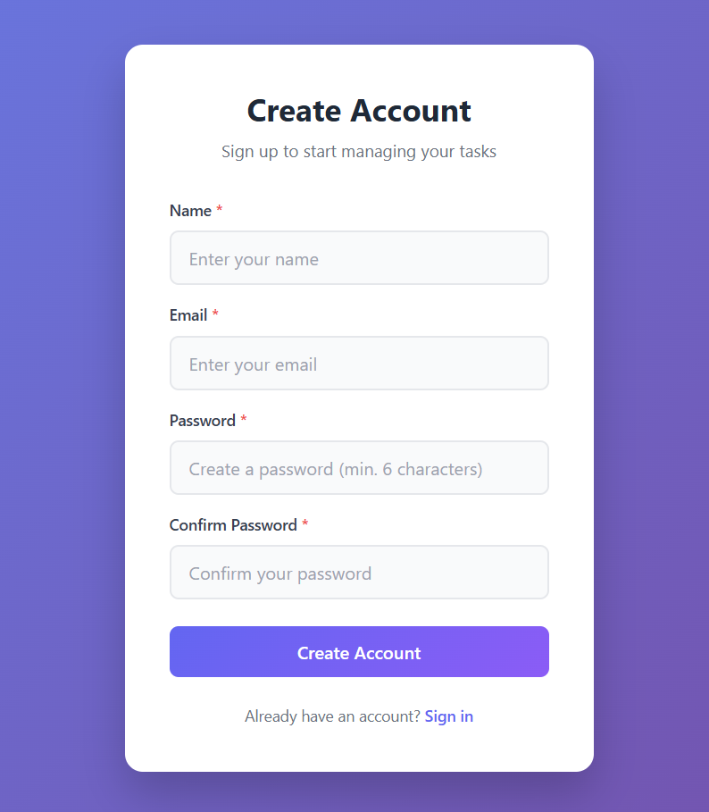
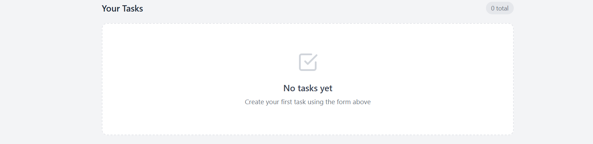
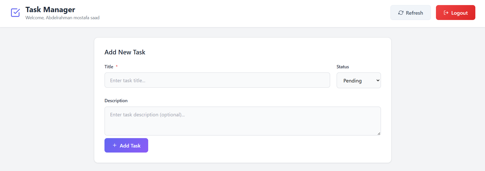

# Task Manager Application

A full-stack Task Manager application built with a **React** frontend and a **Laravel** backend. This application allows users to register, log in, and manage their tasks with a clean and responsive user interface.

## 🚀 Features

*   **Authentication**: Secure User Registration and Login using Laravel Sanctum (Token-based Authentication).
*   **Task Management**: Create, Read, Update, and Delete (CRUD) tasks.
*   **Task Status**: Track tasks with statuses (Pending, In Progress, Done).
*   **Pagination**: Efficiently browse through your list of tasks.
*   **Protected Routes**: Prevents unauthorized access to task management pages.
*   **Responsive Design**: Works on desktop and mobile devices.

## 🛠️ Tech Stack

### Frontend
*   **React 19**: Modern UI library.
*   **Vite**: Fast build tool and development server.
*   **React Router DOM**: Client-side routing.
*   **Axios**: HTTP client for API requests (with interceptors for token handling).
*   **React Icons**: For UI icons.
*   **CSS**: Custom responsive styling with CSS variables.

### Backend
*   **Laravel 12**: Modern PHP framework.
*   **Laravel Sanctum**: Lightweight authentication system for SPAs (Token-based).
*   **Eloquent ORM**: Laravel's built-in ORM for database interaction.
*   **SQLite**: Lightweight, file-based relational database.
*   **Bcrypt**: Password hashing for security (Laravel's default).

## 📸 Screenshots

### Login Page
Clean and secure login interface.


### Registration Page
New users can easily sign up.


### Task Dashboard
View all your tasks with pagination and status indicators.


### Add/Edit Task
Simple form to create or update tasks.


## 📂 Project Structure

```
task manager/
├── task-manager-api/   # Laravel API
│   ├── app/
│   │   ├── Http/
│   │   │   ├── Controllers/  # Request handlers
│   │   │   └── Requests/     # Form validation
│   │   ├── Models/           # Eloquent models (User, Task)
│   │   └── Traits/           # Reusable traits (ApiResponse)
│   ├── config/               # Application configuration
│   ├── database/
│   │   ├── migrations/       # Database schema
│   │   └── seeders/          # Data seeders
│   ├── routes/               # API routes
│   └── database.sqlite       # SQLite database file
│
├── frontend/           # React Application
│   ├── src/
│   │   ├── api/        # Axios setup
│   │   ├── components/ # Reusable UI components
│   │   ├── context/    # Auth state management
│   │   ├── pages/      # Application pages (Login, Tasks, etc.)
│   │   └── routes/     # Routing configuration
│   └── vite.config.js  # Vite config (proxy setup)
│
└── screenshots/        # Project screenshots
```

## 🏁 Getting Started

### Prerequisites
*   **PHP** (v8.2 or higher)
*   **Composer** (PHP dependency manager)
*   **Node.js** (v18 or higher recommended)
*   **npm** (Node Package Manager)

### 1. Setup Backend (Laravel)

Navigate to the backend folder and install dependencies:

```bash
cd task-manager-api
composer install
```

Create environment file and generate app key:

```bash
cp .env.example .env
php artisan key:generate
```

Run database migrations:

```bash
php artisan migrate
```

Start the backend server (runs on `http://localhost:8000`):

```bash
php artisan serve
```

### 2. Setup Frontend

Open a new terminal, navigate to the frontend folder, and install dependencies:

```bash
cd frontend
npm install
```

Start the frontend development server (runs on `http://localhost:5173`):

```bash
npm run dev
```

### 3. Usage
1.  Open your browser and go to `http://localhost:5173`.
2.  Register a new account.
3.  Log in and start managing your tasks!

## 📝 API Documentation

The backend exposes the following RESTful endpoints:

*   `POST /api/auth/register` - Create a new user.
*   `POST /api/auth/login` - Authenticate user and get token.
*   `POST /api/auth/logout` - Logout and invalidate token.
*   `GET /api/tasks` - Get paginated list of tasks.
*   `POST /api/tasks` - Create a new task.
*   `PUT /api/tasks/{id}` - Update an existing task.
*   `DELETE /api/tasks/{id}` - Delete a task.

---
**Enjoy managing your tasks!**
